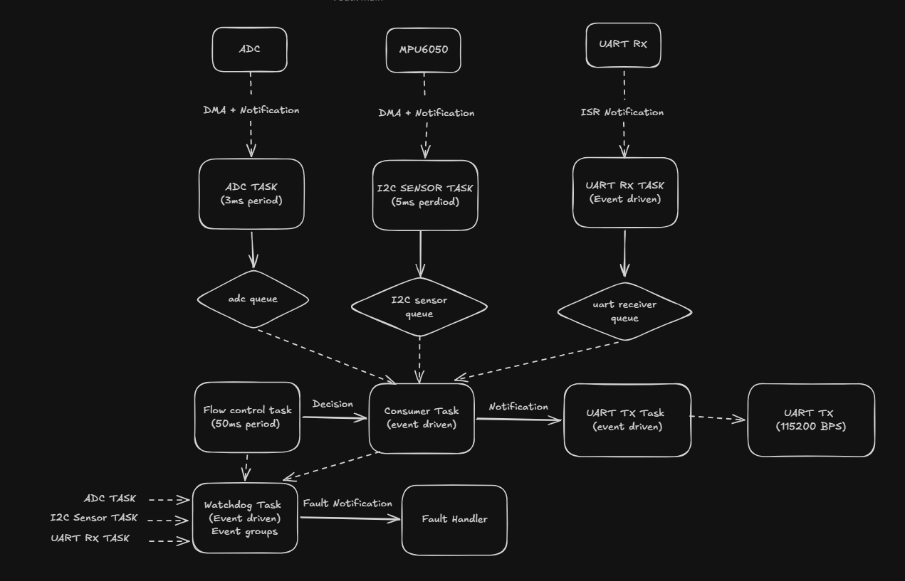
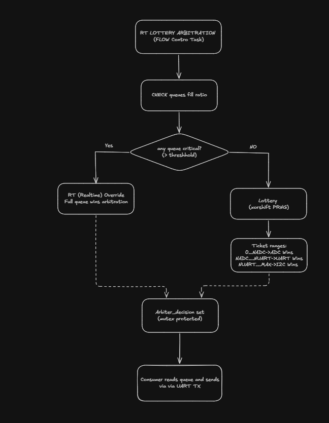
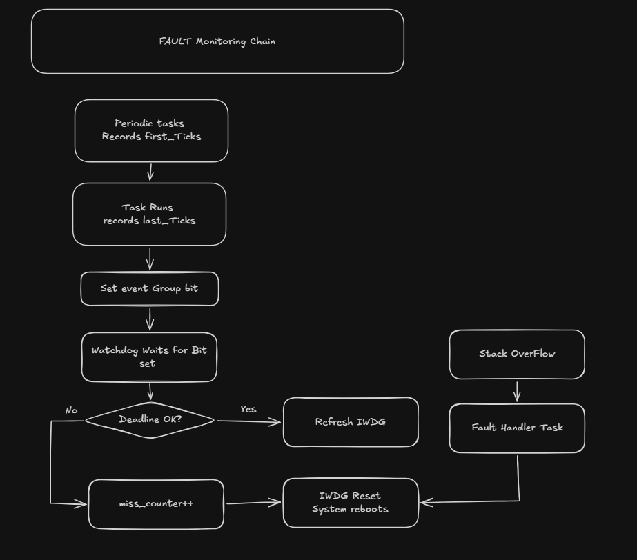
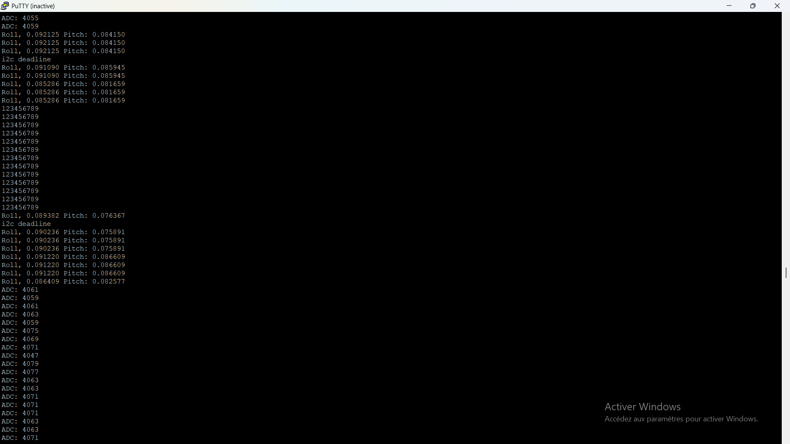

# STM32 FreeRTOS Fault-Tolerant Multi-Task System

A real-time embedded system built on the **STM32F401RE** running **FreeRTOS**, exploring the practical trade-offs of task design, synchronization primitives, fair resource arbitration, and fault tolerance.

---

## Table of Contents

- [System Overview](#system-overview)
- [Hardware Setup](#hardware-setup)
- [Task Architecture](#task-architecture)
- [Communication: DMA vs Interrupts](#communication-dma-vs-interrupts)
- [Synchronization: Choosing the Right Primitive](#synchronization-choosing-the-right-primitive)
- [The RT-Lottery Arbitration Problem](#the-rt-lottery-arbitration-problem)
- [Fault Monitoring](#fault-monitoring)
- [Results and Performance](#results-and-performance)
- [Project Structure](#project-structure)

---

## System Overview

Three data producers — an ADC sensor, an MPU6050 IMU over I2C, and a UART receiver — all compete for a single output channel (UART TX to a PC terminal). The core challenge: **how do you fairly arbitrate access while ensuring no producer starves and real-time deadlines are always met?**

**Data flow**: producers push to their individual queues → Consumer reads based on Flow Control's arbitration decision → outputs via UART TX.

**Monitoring layer**: the Watchdog task monitors periodic task deadlines using event groups and keeps the hardware IWDG alive. The Fault Handler responds to critical errors via task notifications.

---

## Hardware Setup


- **MCU**: STM32F401RE (Nucleo board)
- **IMU**: MPU6050 connected over I2C
- **ADC**: onboard, reading an analog signal
- **UART**: communication with a PC terminal (PuTTY) at 115200 bps
- **Logic Analyzer**: Saleae Logic 2, used to observe task timing, IDLE time, I2C bus activity, and UART TX bursts

---

## Task Architecture

The system has **6 tasks**, each with a deliberate design choice between periodic and event-driven execution.

### Periodic tasks — when timing predictability matters

The ADC task, I2C sensor task, and Flow Control task all run on fixed periods. Using a fixed-reference wake mechanism (rather than a simple delay after execution) ensures the period stays exact regardless of how long the task body takes to run. This matters for deadline monitoring — if a task drifts, the watchdog will catch it.

| Task | Period | Role |
|---|---|---|
| ADC Task | 3 ms | Samples ADC via DMA, pushes to queue |
| I2C Sensor Task | 5 ms | Reads MPU6050 via DMA, pushes to queue |
| Flow Control Task | 50 ms | Runs RT-Lottery arbitration, sets arbiter_decision |

### Event-driven tasks — when sleeping is better than polling

The UART RX task, Consumer task, and Fault Handler sleep indefinitely until signalled. They consume zero CPU while waiting, which is a large part of why the system maintains significant CPU headroom even under full peripheral load.

| Task | Wake condition | Role |
|---|---|---|
| UART RX Task | ISR notification on frame complete | Copies data locally, pushes to queue |
| Consumer Task | Notification from Flow Control | Reads selected queue, sends via UART TX |
| Fault Handler | Task notification on error | Logs fault, suppresses IWDG refresh → system reset |



---

## Communication: DMA vs Interrupts

The choice between DMA and interrupt-driven transfers is not cosmetic — it directly affects CPU availability and task wake latency.

| Peripheral | Method | Reasoning |
|---|---|---|
| I2C (MPU6050) | DMA | Transfers 14 bytes per read. CPU is completely free during transfer. Task sleeps and is woken by a notification from the DMA complete callback. |
| ADC | DMA | Continuous background sampling with zero CPU involvement. |
| UART RX | Interrupt | Data arrives in small, unpredictable frames. An interrupt fires on frame completion and immediately wakes the sleeping task via notification. |
| UART TX | Interrupt | Consumer sends a frame, then sleeps until a TX complete notification arrives before starting the next cycle. |

**Key insight**: DMA is the right choice when data is bulk and timing is not urgent — the CPU can go do something else entirely. Interrupts are the right choice when data is small and latency to wake the task matters more than throughput.

---

## Synchronization: Choosing the Right Primitive

Four different FreeRTOS synchronization primitives are used, each chosen for a specific reason.

### Queues — passing data safely between tasks

Each producer has its own dedicated queue sized for its data type: raw ADC values, IMU structs (6 floats of roll/pitch/yaw data), and raw UART byte arrays. Queues provide atomic copying — there is no risk of reading half-updated data — and they naturally buffer rate mismatches between producers and the Consumer.

**Why not shared global variables?** A shared variable with no protection can be partially written when read. A queue copy is atomic by design.

### Task notifications — lightest possible 1-to-1 signalling

Every ISR-to-task signal in the system uses task notifications. They require no kernel object allocation — the notification value lives directly in the task control block. This makes them faster and cheaper than binary semaphores for ISR wakeups.

**Trade-off**: notifications only work for 1-to-1 signalling. If multiple senders need to signal the same task, a semaphore or event group is the right tool instead.

### Mutex with priority inheritance — protecting shared state

The shared arbitration buffer (the decision written by Flow Control and read by Consumer) is protected by a mutex. Mutexes in FreeRTOS implement **priority inheritance**: if a high-priority task blocks waiting for a mutex held by a low-priority task, the low-priority task temporarily runs at the higher priority to release it faster. This prevents unbounded priority inversion.

**Why not a binary semaphore?** Binary semaphores have no priority inheritance. In a system with mixed task priorities, this can cause a high-priority task to stall for an unpredictable and unbounded amount of time.

### Event groups — monitoring multiple tasks in a single call

The Watchdog task needs to know that all three periodic tasks have completed their work within their deadlines. Event groups allow it to block on a single call waiting for all three bits to be set — with a deadline timeout. If the timeout expires before all bits are set, a miss is recorded.

**Why not three separate semaphores?** Each semaphore would require a separate blocking call. The event group collapses this into one, which is both simpler and more efficient.

---

## The RT-Lottery Arbitration Problem

With three producers filling queues at different rates, a naive arbitration policy like round-robin or strict priority leads to either starvation or poor bus utilization. This system adapts the **RT_lottery** algorithm proposed by Chen et al. in:

> *"A Real-Time and Bandwidth Guaranteed Arbitration Algorithm for SoC Bus Communication"*  
> Chien-Hua Chen, Geeng-Wei Lee, Juinn-Dar Huang, Jing-Yang Jou — ASP-DAC 2006  
> https://www.cecs.uci.edu/~papers/aspdac06/pdf/p600_6B-3.pdf

The original algorithm was designed for SoC bus arbitration between hardware masters. Here it is adapted for software task arbitration over a shared UART output channel.

### Two-layer solution

**Layer 1 — Real-time override**: if any queue's fill ratio exceeds a critical threshold, that producer gets the output bus immediately, regardless of the lottery result. This prevents queue overflow and guarantees bounded latency for time-sensitive producers.

**Layer 2 — Weighted lottery**: when all queues are healthy, a fast PRNG (xorshift32) draws a ticket. Each producer owns a range of the ticket space proportional to its required bandwidth share. The producer whose range contains the drawn ticket wins the current cycle.

**Why lottery over round-robin?** Round-robin is deterministic and periodic. Combined with periodic producer tasks, this creates resonance — certain producers are systematically served at the same phase of their period while others are delayed. Lottery breaks these timing correlations while still providing statistical fairness over time.



---

## Fault Monitoring

The system implements a two-path fault monitoring layer on top of the hardware IWDG watchdog.

### Path 1 — Software deadline monitoring

Each periodic task records its start tick at the beginning of its body and its end tick after completing work, then sets its dedicated event group bit. The Watchdog task waits for all bits with a deadline timeout. If the actual execution window exceeds the configured deadline, a miss counter increments. Once misses accumulate beyond a threshold, the Watchdog stops refreshing the hardware IWDG and the system resets cleanly.

| Task | Deadline |
|---|---|
| ADC Task | 4 ms |
| I2C Sensor Task | 8 ms |
| Flow Control Task | 20 ms |

### Path 2 — Stack overflow recovery

FreeRTOS detects stack overflows through its stack overflow hook. When triggered, a task notification is sent to the Fault Handler, which suppresses IWDG refreshes and forces a controlled system reset.



---

## Results and Performance

### Logic analyzer — task timing and IDLE time


Seven signals captured simultaneously: I2C CLK, I2C SDA, ESP TX (UART RX input), UART TX output, WDOG heartbeat, IDLE task, and Consumer task activity.

Key observations:
- The **IDLE signal** (green) is consistently active between task executions, confirming the CPU is not saturated.
- The **I2C bus** (pink/orange) shows regular burst transfers from the MPU6050 DMA reads.
- The **Consumer** (blue) fires in short bursts after each arbitration cycle.
- The **WDOG** signal pulses regularly, confirming the hardware watchdog is being refreshed on schedule.

### UART output — arbitration in action


The terminal output shows the RT-Lottery at work: ADC values, IMU Roll/Pitch data, and UART RX echo strings interleaved according to their ticket weights. The "i2c deadline" messages appear when the I2C task's deadline is intentionally stressed during limit testing.

### Fault detection



When deadline violations are injected, the monitoring chain correctly triggers: miss counters increment, IWDG refresh is suppressed, and the system resets. Recovery is clean with no data corruption observed.

### Performance headroom

When pushing the system to its absolute limits by minimizing producer task periods, the bottleneck hit was the **I2C hardware protocol ceiling** — the bus physically cannot deliver bytes any faster. At that saturation point, the STM32F401RE was still running below **70% CPU utilization**, clearly visible as consistent IDLE signal activity on the logic analyzer.

This headroom is significant. It means the same MCU, under the same fully-saturated peripheral load, still has capacity for additional sensors, more complex sensor fusion, or compute-intensive workloads like FFT and other DSP algorithms — without requiring a faster chip.

---

## Project Structure

```
App/Src/
├── app_tasks.c      # All task handlers and RT-Lottery arbitration logic
├── mpu6050.c        # I2C sensor driver with DMA support
├── adc_sensor.c     # ADC sampling
└── uart_device.c    # UART communication

Core/Src/
├── main.c           # RTOS init, queue/mutex/event group creation, task spawning
└── stm32f4xx_it.c   # ISR handlers, task notification calls

ThirdParty/FreeRTOS/
└── FreeRTOSConfig.h # Tick rate, task priorities, heap size
```

---

*STM32F401RE · FreeRTOS · MPU6050 · DMA · UART · ADC · Logic Analyzer*