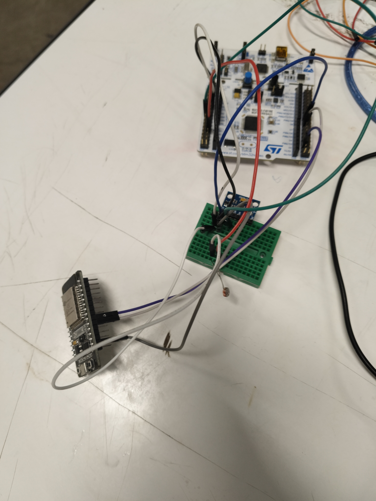
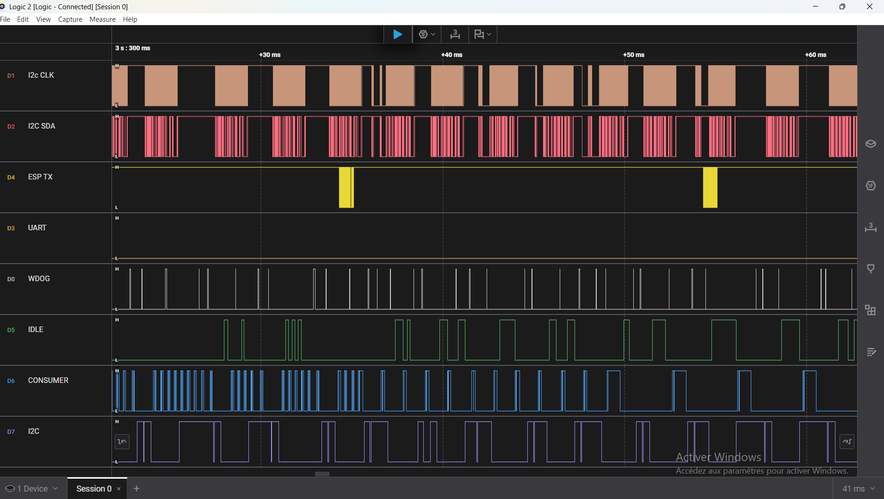
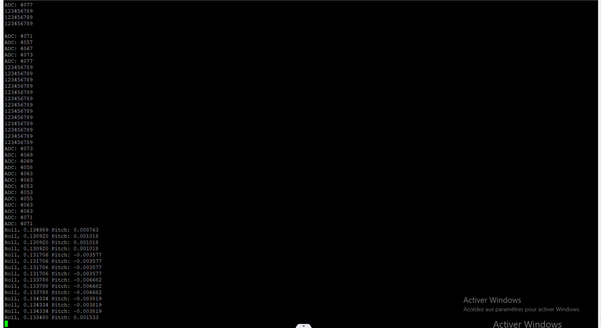

# STM32 FreeRTOS Multi-Task System

A real-time system demonstrating FreeRTOS task design patterns on STM32F401RE. This project explores the practical trade-offs between **periodic vs event-driven tasks**, when to use **queues vs notifications vs event groups**, and how to implement **fair resource arbitration** between competing producers.

## Table of Contents
- [System Overview](#system-overview)
- [Task Design: Periodic vs Event-Driven](#task-design-periodic-vs-event-driven)
- [Synchronization: Choosing the Right Primitive](#synchronization-choosing-the-right-primitive)
- [The RT-Lottery Arbitration Problem](#the-rt-lottery-arbitration-problem)
- [Fault Monitoring with Event Groups](#fault-monitoring-with-event-groups)
- [Results and Performance](#results-and-performance)
- [Getting Started](#getting-started)

## System Overview

The system has three data producers (ADC sensor, MPU6050 IMU, UART receiver) competing for a single output channel (UART to PC). The core challenge: **how do you fairly arbitrate access while ensuring no producer starves and real-time deadlines are met?**



```
                              ┌─────────────────┐
                              │  Flow Control   │ Decides which queue
                              │   (Periodic)    │ the Consumer reads
                              └────────┬────────┘
                                       │ arbiter_decision
                                       ▼
┌─────────────┐  ┌───────┐    ┌─────────────────┐
│ ADC Task    │──│ Queue │───►│                 │
│ (Periodic)  │  └───────┘    │                 │
│ DMA+Notify  │               │    Consumer     │───► UART TX to PC
└─────────────┘               │   (Event-Driven)│
┌─────────────┐  ┌───────┐    │                 │
│ I2C Task    │──│ Queue │───►│                 │
│ (Periodic)  │  └───────┘    └─────────────────┘
│ DMA+Notify  │                       ▲
└─────────────┘               ┌───────┘
┌─────────────┐  ┌───────┐    │
│ UART RX     │──│ Queue │────┘
│ (Event)     │  └───────┘
│ Interrupt   │
└─────────────┘

        ┌───────────────────────────────────────┐
        │           Monitoring Layer            │
        ├───────────────────┬───────────────────┤
        │   Watchdog Task   │ Fault Handler     │
        │  (Event Groups)   │ (Notifications)   │
        │  Deadline checks  │ Stack overflow    │
        │  + IWDG refresh   │ + System recovery │
        └───────────────────┴───────────────────┘
```

**Data Flow**: Producers push to their queues → Consumer reads based on Flow Control's decision → Outputs via UART TX.

**Monitoring Layer**: Watchdog monitors periodic task deadlines using event groups. Fault Handler responds to critical errors via task notifications.

### DMA vs Interrupts: When to Use Each

| Peripheral | Method | Why |
|------------|--------|-----|
| **I2C (MPU6050)** | DMA | Large data transfer (14 bytes). CPU is free during transfer. Task waits on notification from `HAL_I2C_MemRxCpltCallback`. |
| **ADC** | DMA | Continuous background sampling. Zero CPU overhead for conversion. |
| **UART RX** | Interrupt | Small, unpredictable data. Interrupt fires on complete frame, wakes task immediately. |
| **UART TX** | Interrupt | Consumer sends data, then waits for TX complete notification before next cycle. |

**DMA Pattern** (I2C sensor task):
```c
MPU6050_Read_IMU_DMA(&imu);  // Starts DMA transfer, returns immediately
// Task continues or blocks on queue
// When DMA completes → HAL_I2C_MemRxCpltCallback → xTaskNotifyFromISR
```

**Interrupt Pattern** (UART RX):
```c
HAL_UART_Receive_IT(&huart1, buffer, size);  // Arms interrupt
xTaskNotifyWait(...);  // Task sleeps
// When frame received → HAL_UART_RxCpltCallback → xTaskNotifyFromISR → Task wakes
```

**Key insight**: DMA is better for bulk transfers where you want the CPU completely free. Interrupts are simpler for small, event-based data where latency matters more than throughput.

## Task Design: Periodic vs Event-Driven

### When to Use Periodic Tasks

Periodic tasks are ideal when you need **predictable, consistent timing**. The sensor tasks use `vTaskDelayUntil()` to guarantee fixed intervals:

```c
void I2CSensorTaskHandler(void *pvParameters) {
    TickType_t xLastWakeTime = xTaskGetTickCount();
    for (;;) {
        MPU6050_Read_IMU_DMA(&imu);
        xQueueSend(i2c_sensor_queue, &imu_queue_item, 0);
        vTaskDelayUntil(&xLastWakeTime, pdMS_TO_TICKS(3));  // Exact 3ms period
    }
}
```

**Why `vTaskDelayUntil()` instead of `vTaskDelay()`?**  
`vTaskDelay(3ms)` waits 3ms *after* execution completes, so total period = execution_time + 3ms (variable). `vTaskDelayUntil()` calculates the next wake time from a fixed reference, maintaining exact periodicity regardless of execution time variations.

### When to Use Event-Driven Tasks

Event-driven tasks sleep until something happens, saving CPU cycles. The UART receiver uses **task notifications** to wake only when data arrives:

```c
void UARTReceiverTaskHandler(void *pvParameters) {
    HAL_UART_Receive_IT(&huart1, uart_rx_buffer, UART_FRAME_SIZE);
    for (;;) {
        xTaskNotifyWait(0, 0, NULL, portMAX_DELAY);  // Sleep until ISR signals
        
        // Copy data locally (ISR might overwrite buffer)
        memcpy(local_buffer, uart_rx_buffer, UART_FRAME_SIZE);
        xQueueSend(uart_receiver_queue, local_buffer, 0);
        
        HAL_UART_Receive_IT(&huart1, uart_rx_buffer, UART_FRAME_SIZE);
    }
}
```

**Key insight**: The task consumes zero CPU while waiting. The ISR triggers it directly via `xTaskNotifyFromISR()`.

## Synchronization: Choosing the Right Primitive

### Queues: When You Need to Pass Data

Queues handle the producer-consumer pattern with built-in thread safety. Each queue is sized for its specific data type:

```c
adc_sensor_queue = xQueueCreate(ADC_QUEUE_SIZE, sizeof(uint16_t));      // Small values
i2c_sensor_queue = xQueueCreate(I2C_QUEUE_SIZE, sizeof(imu_data_t));    // Struct with 6 floats
uart_receiver_queue = xQueueCreate(UART_QUEUE_SIZE, UART_FRAME_SIZE);   // Byte arrays
```

**Why queues instead of shared variables?**  
Queues provide atomic copying—no chance of reading half-updated data. They also naturally decouple producer/consumer rates through buffering.

### Task Notifications: When You Just Need to Signal

Task notifications are the lightest synchronization primitive—no kernel object allocation, just a 32-bit value embedded in the task control block.

**Used here for:**
- ISR → Task signaling (UART RX complete, UART TX complete, I2C DMA complete)

```c
// In HAL callback (ISR context)
void HAL_UART_RxCpltCallback(UART_HandleTypeDef *huart) {
    xTaskNotifyFromISR(UARTReceiverTask, 0, eNoAction, &xHigherPriorityTaskWoken);
}
```

**Why notifications instead of binary semaphores?**  
Faster (no kernel object lookup) and uses less RAM. The trade-off: only works for 1-to-1 signaling to a specific task.

### Mutexes: When You Need Exclusive Access

The `arbitration_mutex` protects the shared frame buffer that both Flow Control and Consumer tasks access:

```c
xSemaphoreTake(arbitration_mutex, portMAX_DELAY);
// Modify arbiter_decision and write_buf safely
xSemaphoreGive(arbitration_mutex);
```

**Why a mutex instead of a binary semaphore?**  
Mutexes implement priority inheritance—if a high-priority task blocks on a mutex held by a low-priority task, the low-priority task temporarily inherits the higher priority. This prevents unbounded priority inversion.

### Event Groups: When You Need to Monitor Multiple Conditions

The watchdog needs to verify that multiple periodic tasks are still running. Event groups let it wait for several bits simultaneously:

```c
// Each periodic task sets its bit after completing work
xEventGroupSetBits(wdog_event_group, BIT_0);  // ADC done
xEventGroupSetBits(wdog_event_group, BIT_1);  // I2C done
xEventGroupSetBits(wdog_event_group, BIT_2);  // Flow Control done

// Watchdog waits for all bits with timeout (deadline monitoring)
EventBits_t bits = xEventGroupWaitBits(wdog_event_group, 
                                       BIT_0 | BIT_1 | BIT_2,
                                       pdTRUE,    // Clear bits on exit
                                       pdFALSE,   // Wait for ANY bit
                                       deadline_timeout);
```

**Why event groups instead of multiple semaphores?**  
A single blocking call monitors all tasks. With semaphores, you'd need separate waits or complex polling logic.

## The RT-Lottery Arbitration Problem

With three producers filling queues at different rates, how do you decide who gets the output bus? 

### Two-Layer Solution

**Layer 1 - Real-Time Priority**: If any queue exceeds a critical threshold, that producer gets immediate access. This prevents overflow:

```c
if (i2c_queue_ratio >= I2C_MAX_CONSUMPTION_RATIO) {
    arbiter_decision = I2C_OWNERSHIP;  // Emergency: I2C queue nearly full
}
else if (adc_queue_ratio >= ADC_MAX_CONSUMPTION_RATIO) {
    arbiter_decision = ADC_OWNERSHIP;  // Emergency: ADC queue nearly full
}
```

**Layer 2 - Lottery**: When all queues are healthy, use weighted random selection. Each producer has a ticket range proportional to its importance:

```c
uint16_t random_ticket = xorshift32_star();  // Fast PRNG (xorshift algorithm)

if (random_ticket <= ADC_MAX_LOTTERY_TICKET) {
    arbiter_decision = ADC_OWNERSHIP;
} else if (random_ticket <= UART_MAX_LOTTERY_TICKET) {
    arbiter_decision = UART_OWNERSHIP;
} else {
    arbiter_decision = I2C_OWNERSHIP;
}
```

**Why lottery instead of round-robin?**  
Round-robin is deterministic and can create resonance issues with periodic tasks. Lottery provides statistical fairness while breaking timing correlations.

## Fault Monitoring with Event Groups

The system implements software deadline monitoring on top of the hardware watchdog:

```c
typedef struct {
    EventBits_t bit;        // Which event group bit represents this task
    TickType_t firstTick;   // When task started
    TickType_t lastTick;    // When task finished
    TickType_t deadline;    // Maximum allowed execution time
} wdog_task_t;

wdog_task_t wdog_task[] = {
    {ADC_TASK_BIT, 0, 0, ADC_TASK_DEADLINE},         // 4ms deadline
    {I2C_TASK_BIT, 0, 0, I2C_TASK_DEADLINE},         // 8ms deadline
    {FLOW_CONTROL_TASK_BIT, 0, 0, FLOW_CONTROL_DEADLINE}  // 20ms deadline
};
```

Each periodic task records its start/end times and sets its event bit. The Watchdog task checks if actual execution exceeded the deadline. If too many misses occur, the hardware watchdog isn't refreshed and the system resets.

**Stack overflow detection** is handled via FreeRTOS hooks:
```c
void vApplicationStackOverflowHook(TaskHandle_t xTask, char *pcTaskName) {
    // Log error, trigger watchdog reset
}
```


## Results and Performance






## Project Structure
```
App/Src/
├── app_tasks.c    # All task handlers and RT-Lottery logic
├── mpu6050.c      # I2C sensor driver with DMA
├── adc_sensor.c   # ADC sampling
└── uart_device.c  # UART communication

Core/Src/
├── main.c         # RTOS init, queue/mutex creation, task spawning
└── stm32f4xx_it.c # ISRs with xTaskNotifyFromISR calls

ThirdParty/FreeRTOS/
└── FreeRTOSConfig.h  # Tick rate, priorities, heap size
```

---
*STM32F401RE | FreeRTOS | MPU6050 | DMA | UART | IT | ADC*